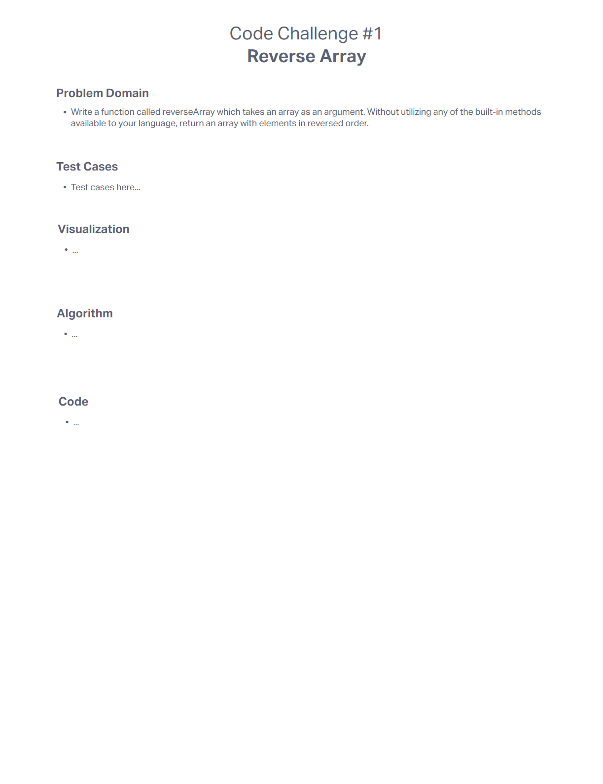

# [Code 401 - Code Challenges](https://mel-johnston.github.io/reading-notes/#code-challenges)

## Code Challenge 01 - Reverse Array

___

### Objective

Write a function called reverseArray which takes an array as an argument. Without utilizing any of the built-in methods available to your language, return an array with elements in reversed order.
___

### Whiteboard Process

___

### Approach & Efficiency

___